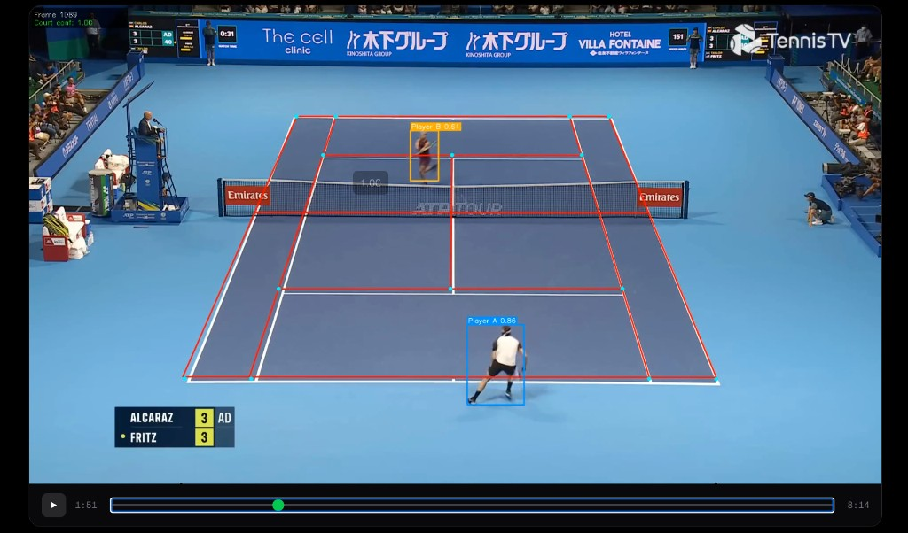
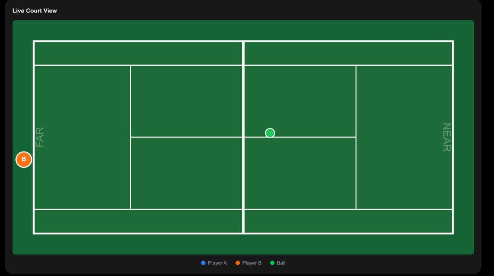
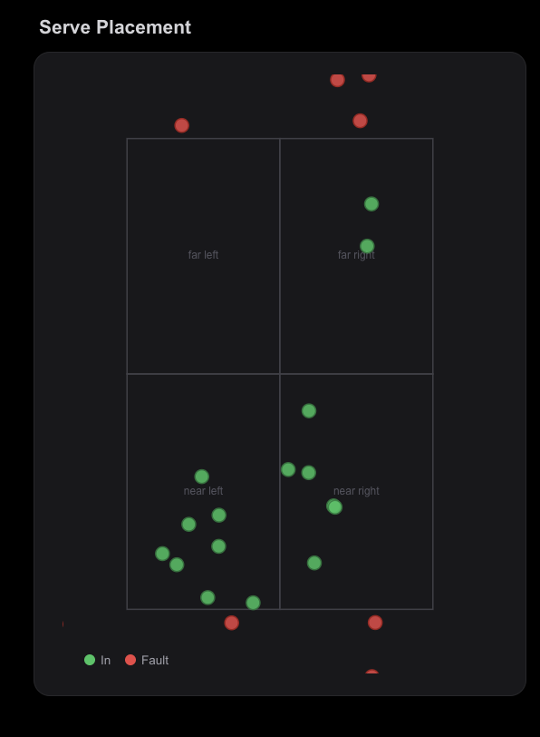
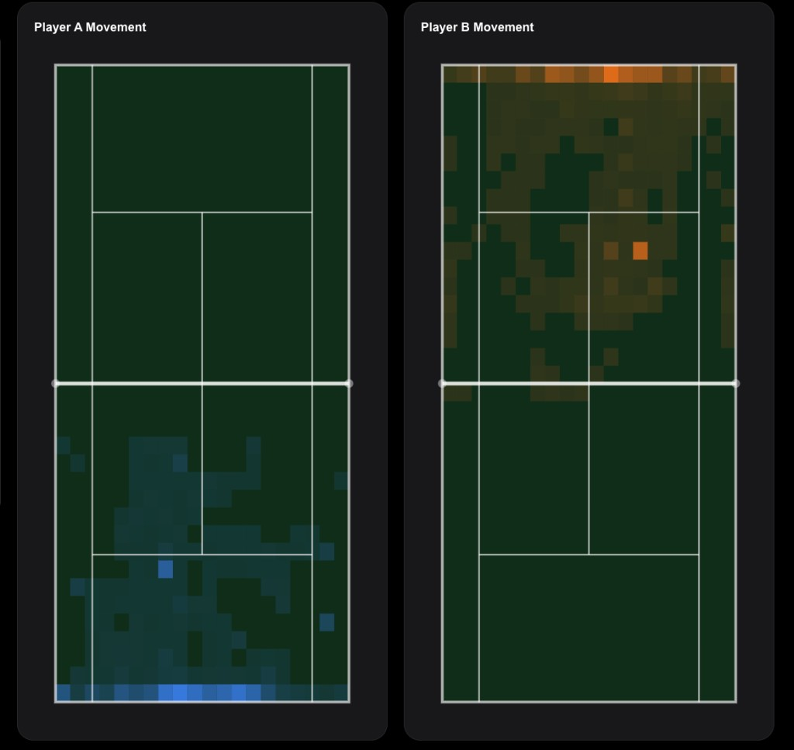
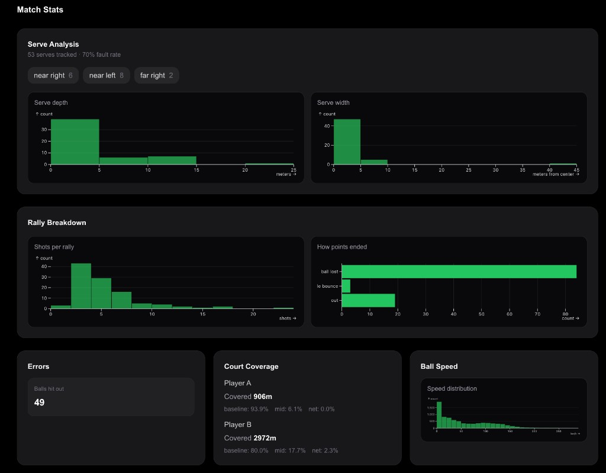

# TennisIQ

**Tennis vision intelligence from match video** — upload an MP4/MOV or paste a YouTube link, run inference on **Modal GPU**, and open a shareable results dashboard with court tracking, heatmaps, serve analytics, and AI-style coaching summaries.

---

## Screenshots

_Images live in [`docs/readme/`](docs/readme/). Replace the PNGs there anytime — see [`docs/readme/README.md`](docs/readme/README.md)._

### CV overlay on match footage

Frame-accurate **court line mapping**, **player boxes** with confidence, and labels for **Player A / Player B** over the broadcast feed.



### Live 2D court view

**Bird’s-eye court** synced to playback: **near / far** sides, **ball** position, and **player markers** so you can read spacing and coverage at a glance.



### Serve placement

Serves plotted on the **service boxes** (far left/right, near left/right): **green** = in play, **red** = faults — for pattern and accuracy review.



### Player movement heatmaps

Per-player **coverage heatmaps** on the same court basis as the pipeline (with **half-court filtering** so each player’s map stays on their side).



### Match stats dashboard

Deeper analytics: **serve depth/width**, **rally length**, **how points ended**, **errors**, **distance / zone time** per player, and **ball speed** distribution.



---

## What It Does

TennisIQ runs a fully automated inference pipeline on your footage:

- **Court detection** — ResNet50 keypoint regression (14 court keypoints per frame)
- **Ball tracking** — YOLOv5 detection with cleanup and interpolation
- **Player detection** — YOLOv8n + ByteTrack with fallbacks and tracking continuity
- **Homography** — Pixel-to **normalized court** coordinates with confidence
- **Events** — Bounce/hit-style signals with **in/out** heuristics where supported
- **Point segmentation** — Groups activity into **points**, **serve zones**, **fault** hints, rally counts
- **Outputs** — Overlay video, **serve placement**, **error / player heatmaps**, **per-point clips**, **coaching cards**, structured **JSON** for the UI

No ML expertise required from the user.

---

## Project Structure

```
TennisIQ/
  docs/readme/       # Screenshots for this README (safe to replace)
  frontend/          # Next.js + Tailwind (results dashboard)
  backend/           # FastAPI + SQLite (API + job orchestration)
  tennisiq/          # CV + Modal inference (court, ball, player, events, analytics)
  checkpoints/       # Model weights (not tracked in git)
  outputs/           # Pipeline results per job (not tracked in git)
  deploy_modal.sh    # Deploy tennisiq/modal_court.py to Modal
```

---

## Prerequisites

- Python 3.11+
- Node.js 18+
- [Modal](https://modal.com) account with API token (for cloud GPU inference)
- Model checkpoints in `checkpoints/`:
  - `court_resnet/keypoints_model.pth`
  - `ball_yolo5/models_best.pt`

---

## Setup

### Backend

```bash
cd backend
pip install -r requirements.txt
cp .env.example .env
# Edit .env with your Modal token and paths
```

Start the API on the **same host/port** your frontend expects (see `frontend/next.config.ts`: by default the Next dev server proxies `/backend/*` to `http://127.0.0.1:8001` unless you set `BACKEND_PROXY_URL`).

```bash
python -m uvicorn main:app --host 127.0.0.1 --port 8001
```

### Frontend

```bash
cd frontend
npm install
cp .env.local.example .env.local
# Optional: NEXT_PUBLIC_API_URL if you call the API directly (otherwise use /backend proxy)
npm run dev
```

### Deploy Modal pipeline

```bash
# From repo root
pip install modal
modal token set --token-id YOUR_TOKEN_ID --token-secret YOUR_TOKEN_SECRET
modal deploy tennisiq/modal_court.py
```

---

## Environment Variables

### Backend (`backend/.env`)

| Variable | Description |
|----------|-------------|
| `BACKEND_URL` | URL the pipeline uses for `/status/update` callbacks (must match reachable API address) |
| `FRONTEND_URL` | Frontend origin list for CORS (e.g. `http://localhost:3000`) |
| `OUTPUTS_DIR` | Pipeline output directory (default: `../outputs`) |
| `UPLOAD_DIR` | Uploaded source videos (default: `backend/uploads`) |

### Frontend (`frontend/.env.local`)

| Variable | Description |
|----------|-------------|
| `NEXT_PUBLIC_API_URL` | Optional; if unset, browser uses same-origin `/backend` rewrites |
| `BACKEND_PROXY_URL` | Next rewrite target (see `frontend/next.config.ts`) |

---

## Pipeline Stages (per video segment)

| Phase | Description |
|-------|-------------|
| 1 | Court keypoint detection (ResNet50, 14 keypoints) |
| 2 | Homography + confidence |
| 3 | Ball detection (YOLOv5) + track cleaning |
| 4 | Ball kinematics in court space |
| 5 | Player detection + tracking |
| 6 | Event detection (bounces/hits, in/out where available) |
| 6b | Point segmentation (serves, faults, rally metrics) |
| 7 | Structured JSON + coaching cards + chart data |
| 8 | Overlay render + per-point clips |

---

## How It Works

1. User uploads a file or submits a YouTube URL on the home page.
2. Backend creates a job, stores the source, and spawns the **Modal** worker pipeline.
3. Video is processed in **segments**; results are merged into `outputs/<run>/`.
4. Results UI shows video, **live court**, **heatmaps**, **serve chart**, **stats**, clips, and export links.

---

## License

See [`LICENSE`](LICENSE) in the repository.
